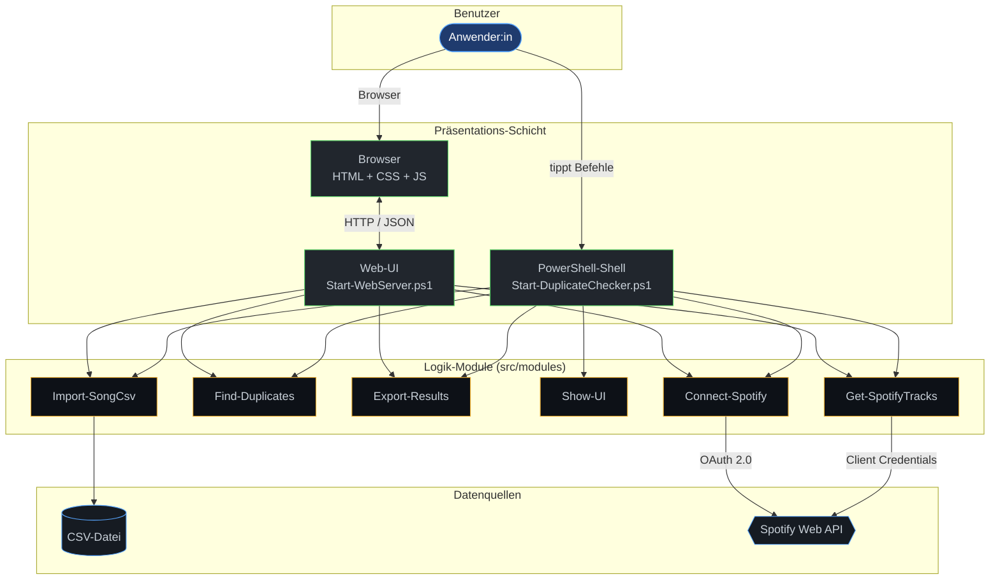
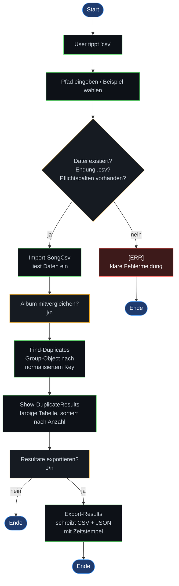
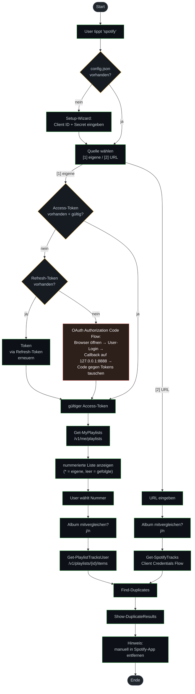
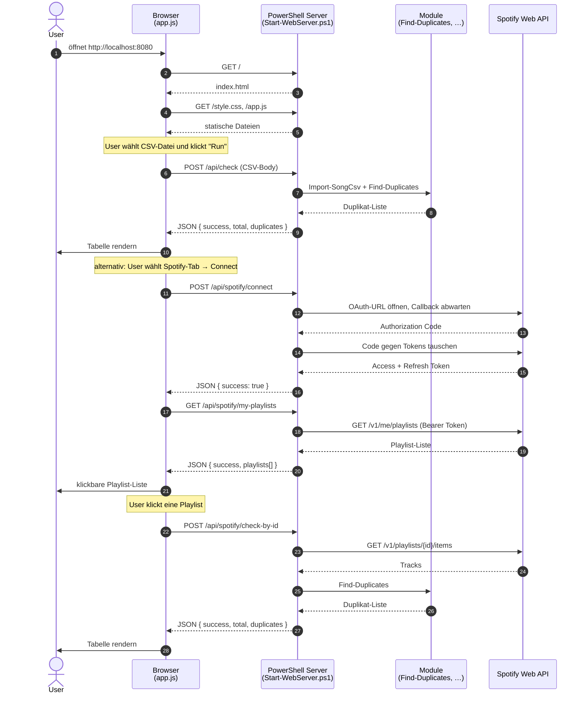
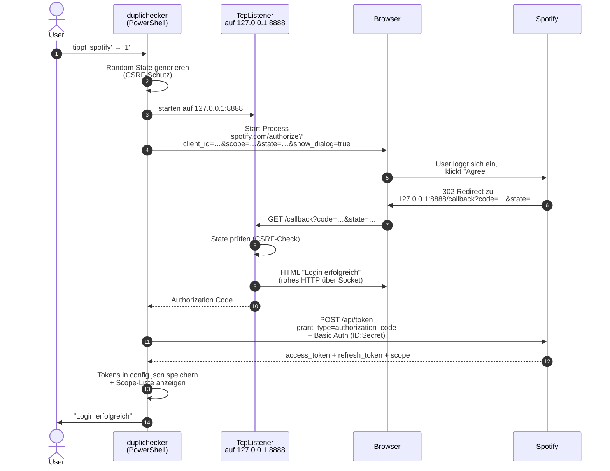
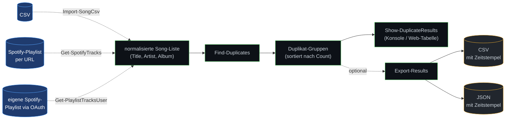

# Flowcharts
## Song-Duplikat-Checker — Modul 122

> Diagramme im **Mermaid**-Format. Sie werden direkt in GitHub, GitLab und VS Code (mit der Mermaid-Extension) gerendert. Zum Export als PNG/PDF/SVG: einfach den Code-Block auf [mermaid.live](https://mermaid.live) einfügen → Download.

---

## 1. System-Architektur (Komponenten-Übersicht)

Zeigt, wie die Schichten zueinander stehen und welche externen Datenquellen angebunden sind.



---

## 2. Hauptablauf — CSV-Modus

Der einfachste Datenfluss. Keine Authentifizierung, keine Netzwerk-Calls.



---

## 3. Hauptablauf — Spotify-Modus (eigene Playlists)

Der komplexeste Flow: OAuth-Login, Token-Management, Playlist-Auswahl.



---

## 4. Web-Modus — Request/Response-Fluss

Wie ein Browser-Klick eine API-Anfrage auslöst und der PowerShell-Server sie verarbeitet.



---

## 5. Duplikat-Erkennung — die Kernlogik

Das Herz des Tools. Aus einer Liste roher Songs werden gruppierte Duplikate.

```mermaid
flowchart LR
    Input[/"Liste von Songs<br/>(Title, Artist, Album)"/] --> Loop["Für jeden Song:"]
    Loop --> Norm["Titel + Artist normalisieren<br/>(Trim, Lowercase)"]
    Norm --> Key{"-IncludeAlbum<br/>gesetzt?"}
    Key -->|ja| Key3["Schlüssel:<br/>titel | artist | album"]
    Key -->|nein| Key2["Schlüssel:<br/>titel | artist"]
    Key2 --> Group["Group-Object<br/>nach Schlüssel"]
    Key3 --> Group
    Group --> Filter{"Anzahl pro<br/>Gruppe > 1?"}
    Filter -->|nein| Drop[verwerfen]
    Filter -->|ja| Keep["als Duplikat-Gruppe<br/>aufnehmen"]
    Keep --> Sort["nach Count absteigend<br/>sortieren"]
    Sort --> Output[/"Duplikat-Gruppen<br/>mit Title, Artist, Album, Count"/]

    classDef inout fill:#1f3b6e,stroke:#58a6ff,color:#fff
    classDef proc fill:#0d1117,stroke:#56d364,color:#c9d1d9
    classDef decision fill:#161b22,stroke:#f0b033,color:#c9d1d9
    classDef drop fill:#3d1a1a,stroke:#f85149,color:#fff

    class Input,Output inout
    class Loop,Norm,Key2,Key3,Group,Keep,Sort proc
    class Key,Filter decision
    class Drop drop
```



**Beispiel-Durchlauf** (ohne `IncludeAlbum`):

| Song | Normalisierter Schlüssel |
|---|---|
| `"Imagine"` von `"John Lennon"` | `imagine\|john lennon` |
| `"  imagine  "` von `"John Lennon"` | `imagine\|john lennon` ← **gleicher Key** |
| `"Imagine - Remastered"` von `"John Lennon"` | `imagine - remastered\|john lennon` |
| `"Hey Jude"` von `"The Beatles"` | `hey jude\|the beatles` |

→ `Group-Object` findet 2 Vorkommen von `imagine|john lennon` → eine Duplikat-Gruppe mit Count 2.

---

## 6. OAuth-2.0-Login im Detail

Der genaue Ablauf des Authorization Code Flows mit lokalem Callback-Listener.



---

## 7. Daten-Pipeline (von Eingabe bis Export)

Zusammenfassung des gesamten Datenflusses unabhängig vom Modus.



---

## Export-Hinweis

Wenn das Diagramm für die Schule als **PDF** oder **eingebettetes Bild** gebraucht wird:

1. Den jeweiligen ```` ```mermaid ```` -Block kopieren
2. Auf [mermaid.live](https://mermaid.live) einfügen
3. Oben rechts **Actions → PNG/SVG/PDF** klicken

Alternativ in VS Code: Extension **„Markdown Preview Mermaid Support"** installieren, dann Markdown-Preview öffnen → Strg+P → *„Markdown PDF: Export"*.
