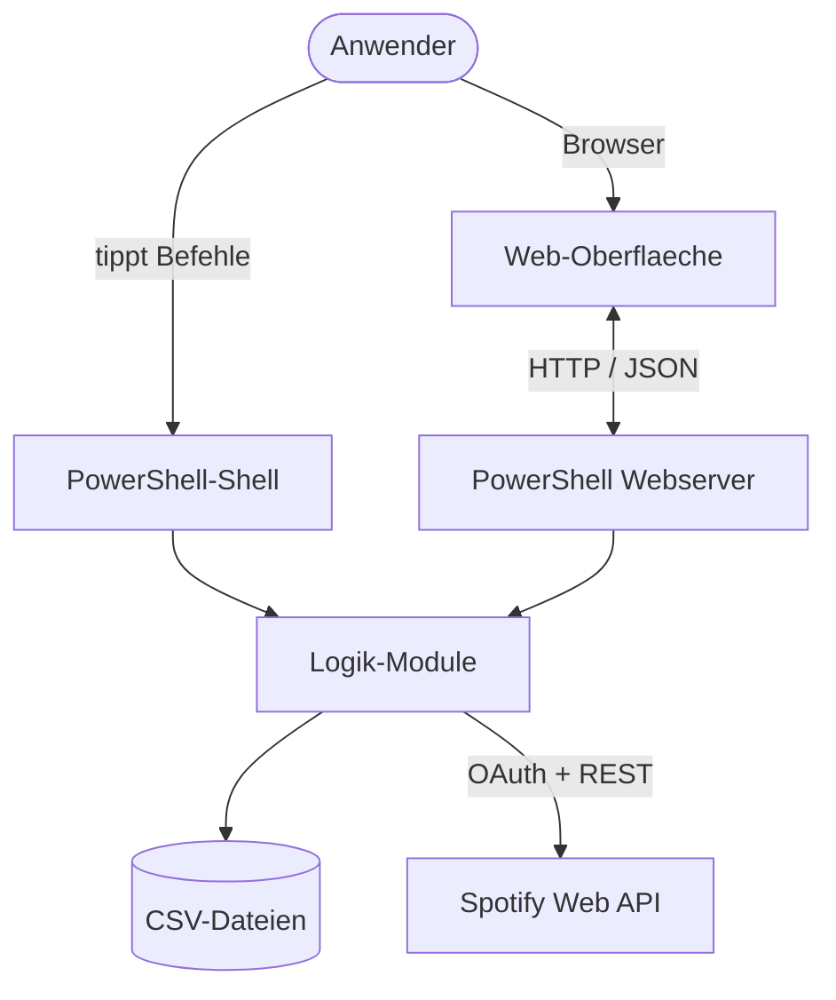
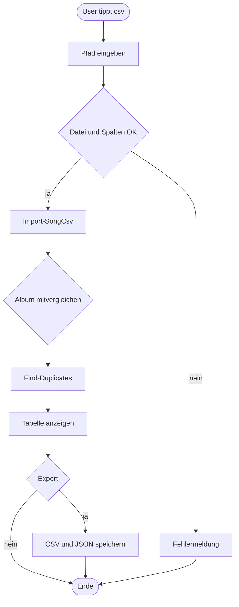
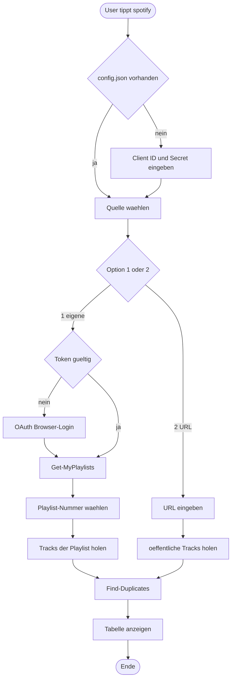
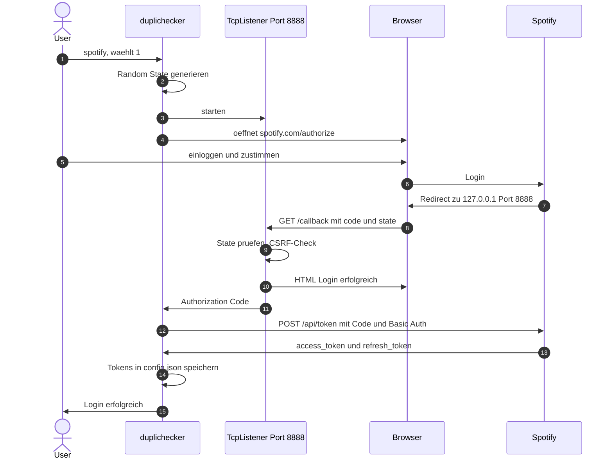
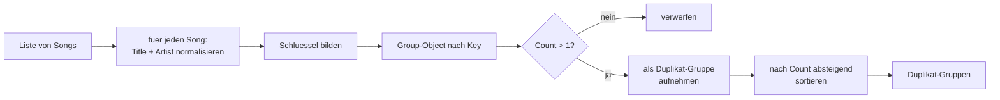
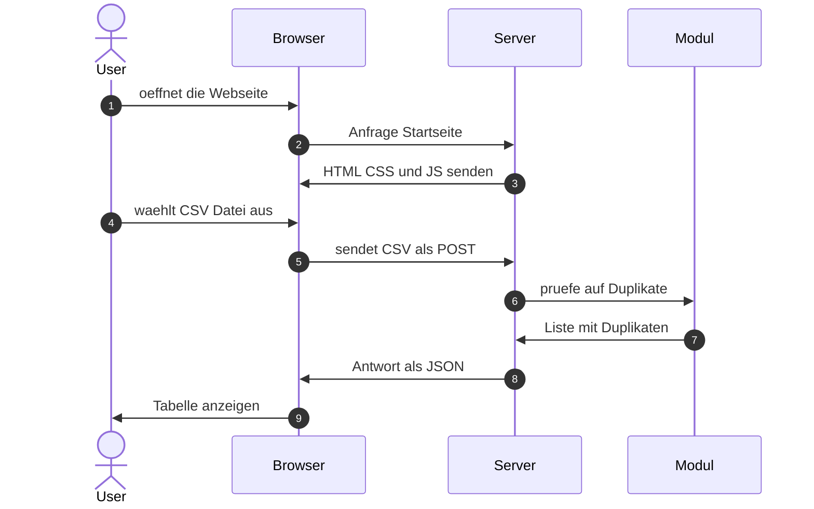

# Flowcharts
## Song-Duplikat-Checker — Modul 122

> Diagramme im **Mermaid**-Format. GitHub, GitLab und VS Code (Extension *„Markdown Preview Mermaid Support"*) rendern sie automatisch. Zum Export als PNG/SVG/PDF: Code-Block auf [mermaid.live](https://mermaid.live) einfügen → Actions → Download.

---

## 1. System-Architektur (Komponenten-Übersicht)

Die wichtigsten Bausteine und wie sie miteinander reden. Bewusst minimal gehalten — jede Box ist eine echte Datei oder ein klarer Verantwortungsbereich.

**Vier saubere Ebenen:** Anwender → Präsentation (CLI **oder** Web) → Logik-Module → externe Datenquellen.

---

## 2. CSV-Modus — Datenfluss

Der einfachste Pfad: Datei einlesen, prüfen, gruppieren, anzeigen.

---

## 3. Spotify-Modus — Datenfluss

Inklusive OAuth-Login und Auswahl-Menü (1 = eigene Playlist, 2 = öffentliche URL).

---

## 4. OAuth-2.0-Login (Sequenz)

Der genaue Ablauf zwischen vier Akteuren: User, PowerShell-Skript, lokaler `TcpListener` (für den Callback) und Spotify.

---

## 5. Duplikat-Erkennung — Kernalgorithmus

Das Herz des Tools: aus einer rohen Songliste werden gruppierte Duplikate.

**Beispiel-Durchlauf** (ohne Album-Vergleich):

| Roh-Eingabe | Normalisierter Schlüssel |
|---|---|
| `"Imagine"` — `"John Lennon"` | `imagine\|john lennon` |
| `"  IMAGINE "` — `"John Lennon"` | `imagine\|john lennon` ← **gleich!** |
| `"Imagine - Remastered"` — `"John Lennon"` | `imagine - remastered\|john lennon` |
| `"Hey Jude"` — `"The Beatles"` | `hey jude\|the beatles` |

→ `Group-Object` findet 2 Treffer für `imagine|john lennon` → eine Duplikat-Gruppe (Count = 2). Die Remastered-Variante zählt nicht dazu, weil der Titel anders ist.

---

## 6. Web-Anfrage (Sequenz)

Wie eine Aktion im Browser (z. B. „CSV hochladen") als HTTP-Request beim PowerShell-Server landet und zurückkommt.

---

## Export-Hinweis

So bekommst du die Diagramme als Bild/PDF in deine Schulpräsentation:

| Methode | Vorgehen |
|---|---|
| **mermaid.live** (am schnellsten) | Code-Block kopieren → [mermaid.live](https://mermaid.live) → Actions → PNG/SVG |
| **VS Code** | Extension *„Markdown Preview Mermaid Support"* → Preview öffnen → über Markdown-PDF-Extension exportieren |
| **GitHub** | rendert direkt beim Hochladen — Screenshots vom Browser nehmen |
